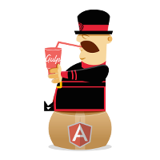

# generator-gulp-angular

[](http://travis-ci.org/Swiip/generator-gulp-angular)
[](https://coveralls.io/r/Swiip/generator-gulp-angular?branch=master)
[](https://david-dm.org/eleven-labs/generator-gulp-angular)
[](https://www.npmjs.org/package/generator-gulp-angular)
[](https://www.npmjs.org/package/generator-gulp-angular)
[](https://gitter.im/Swiip/generator-gulp-angular)
[](https://gratipay.com/Swiip/)

Offers you a Yeoman generator to initiate a Web application with Angular powered by GulpJS.



## Why generator-gulp-angular ?

This generator combines the best features of other generators like [generator-angular](https://github.com/yeoman/generator-angular), [ngTailor](https://github.com/lauterry/generator-ngtailor) and [generator-gulp-webapp](https://github.com/yeoman/generator-gulp-webapp) into an optimal workflow for starting applications with AngularJS powered by Gulp!

generator-gulp-angular scaffolds an AngularJS application with a full-featured gulpfile.js, giving you immediate out-of-the-box access to all tasks for modern web development.


My intention is to create a generator that gives users total control over their development toolbox so they can immediately start projects with their preferred tools, such as specific UI frameworks or JavaScript preprocessors.

This project is one of many things that you can use to get started on a new app.  For a comparison of the options and the trade-offs between them, please visit [this](http://www.dancancro.com/comparison-of-angularjs-application-starters) link.

## Usage

### Create your project

Install the required tools: `yo`, `gulp`, `bower`
```
npm install -g yo gulp bower
```

Install `generator-gulp-angular`:
```
npm install -g generator-gulp-angular
```

Make a new directory, and `cd` into it:
```
mkdir my-new-project && cd $_
```

Run `yo gulp-angular`, optionally passing an app name:
```
yo gulp-angular [app-name]
```

### Yo options
`yo gulp-angular --help` or `yo gulp-angular -h` for help. All options are not required. If not provided, default values will be used.

* `--app-path='src'` customize Angular's app folder, relative to cwd, default is `src`
* `--dist-path='dist'` customize build target folder, relative to cwd, default is `dist`
* `--e2e-path='e2e'` customize e2e test specs folder, relative to cwd, default is `e2e`
* `--tmp-path='.tmp'` customize pre-processing temp folder, relative to cwd, default is `.tmp`
* `--skip-install` do not run `bower install` and `npm install` after generating the app, default is `false` (not skip)
* `--skip-welcome-message` skip yo welcome messages, default is `false` (not skip)
* `--skip-message` skip install messages, default is `false` (not skip)
* `--default` use default configurations, default is `false`
* `--advanced` prompt for advanced additional features, default is `false`


Paths configuration are stored in `gulpfile.js`. Change `options.(src|dist|tmp|e2e)` in `gulpfile.js` if you want to config paths after the app is generated.

**Warning**: The paths are also written in the `index.html` for the build with useref. If you want to change these paths, you also have to change the paths there in order to have the build task working.

### Use Gulp tasks

* `gulp` or `gulp build` to build an optimized version of your application in `/dist`
* `gulp serve` to launch a browser sync server on your source files
* `gulp serve:dist` to launch a server on your optimized application
* `gulp test` to launch your unit tests with Karma
* `gulp test:auto` to launch your unit tests with Karma in watch mode
* `gulp protractor` to launch your e2e tests with Protractor
* `gulp protractor:dist` to launch your e2e tests with Protractor on the dist files

More information on the gulp tasks in [this README.md](app/templates/gulp/README.md).

## Directory structure

[Best Practice Recommendations for Angular App Structure](https://docs.google.com/document/d/1XXMvReO8-Awi1EZXAXS4PzDzdNvV6pGcuaF4Q9821Es/pub)

The root directory generated for a app with name `gulpAngular` :
<pre>
├──  src/
│   ├──  app/
│   │   ├──  components/
│   │   │   └──  navbar/
│   │   │   │   ├──  navbar.controller.(js|coffe)
│   │   │   │   └──  navbar.html
│   │   ├──  main/
│   │   │   ├──  main.controller.(js|coffe)
│   │   │   ├──  main.controller.spec.(js|coffe)
│   │   │   └──  main.html
│   │   └──  index.(js|coffe)
│   │   └──  index.(css|less|scss)
│   │   └──  vendor.(css|less|scss)
│   ├──  assets/
│   │   └──  images/
│   ├──  favico.ico
│   └──  index.html
├──  gulp/
├──  e2e/
├──  bower_components/
├──  nodes_modules/
├──  .bowerrc
├──  .editorconfig
├──  .gitignore
├──  .jshintrc
├──  bower.json
├──  gulpfile.js
├──  karma.conf.js
├──  package.json
├──  protractor.conf.js
</pre>

## Use HTML preprocessor
To use any HTML preprocessor you should change the extension and content of some auto generated files from `.html` to `.(haml|jade|hbs)`.
So the basic structure of your `src` folder should looks like this:
<pre>
...
 src/
├──  app/
│   ├──  components/
│   │   └──  navbar/
│   │   │   ├──  navbar.controller.(js|coffe)
│   │   │   └──  navbar.(haml|jade|hbs)
│   ├──  main/
│   │   ├──  main.controller.(js|coffe)
│   │   ├──  main.controller.spec.(js|coffe)
│   │   └──  main.(haml|jade|hbs)
│   └──  index.(js|coffe)
│   └──  index.(css|less|scss)
│   └──  vendor.(css|less|scss)
├──  assets/
│   └──  images/
├──  favico.ico
└──  index.html
...
</pre>

## Features included in the gulpfile
* *useref* : allow configuration of your files in comments of your HTML file
* *ngAnnotate* : convert simple injection to complete syntax to be minification proof
* *uglify* : optimize all your JavaScript
* *csso* : optimize all your CSS
* *rev* : add a hash in the file names to prevent browser cache problems
* *watch* : watch your source files and recompile them automatically
* *jshint* : JavaScript code linter
* *imagemin* : all your images will be optimized at build
* *Unit test (karma)* : out of the box unit test configuration with karma
* *e2e test (protractor)* : out of the box e2e test configuration with protractor
* *browser sync* : full-featured development web server with livereload and devices sync
* *angular-templatecache* : all HTML partials will be converted to JS to be bundled in the application
* **TODO** lazy : don't process files which haven't changed when possible

## Questions the generator will ask
* *jQuery*: jQuery 1.x, 2.x, Zepto, none
* *Angular modules*: animate, cookies, touch, sanitize
* *Resource handler*: ngResource, Restangular, none
* *Router*: ngRoute, UI Router, none
* *UI Framework*: Bootstrap, Foundation, Angular Material, none (depends on the chosen CSS preprocessor)
* *UI directives* : UI Bootstrap, Angular Strap, official Bootstrap JavaScript, Angular Foundation, official Foundation JavaScript, none (depends on the UI framework)
* *CSS pre-processor*: Less, Sass with Ruby and Node, Stylus, none
* *JS preprocessor*: CoffeeScript, TypeScript, ECMAScript 6 (Traceur and Babel), none
* *HTML preprocessor*: Jade, Haml, Handlebars, none
* **TODO** Script loader: Require, Webpack, none
* **TODO** Test framework: Jasmine, Mocha, Qunit

## Changelog

[All changes listed in the GitHub releases](https://github.com/Swiip/generator-gulp-angular/releases)

## Contributing

[Guidelines](CONTRIBUTING.md)

## License

MIT
